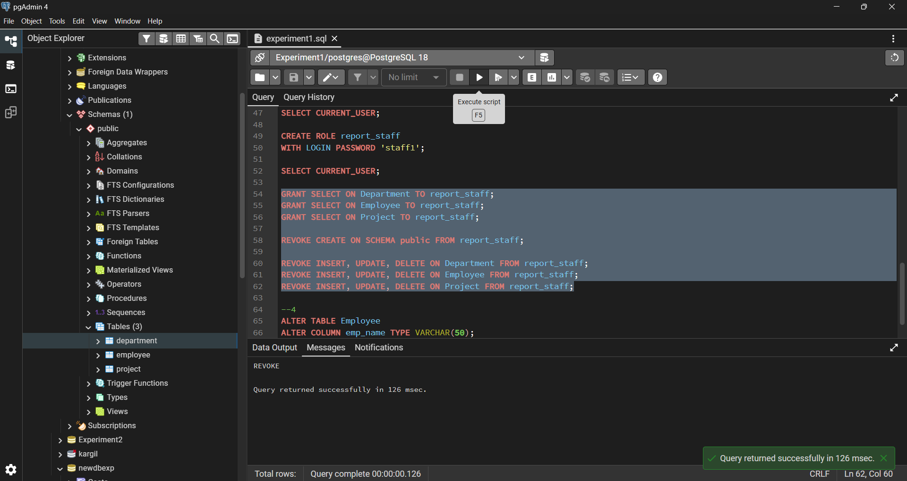
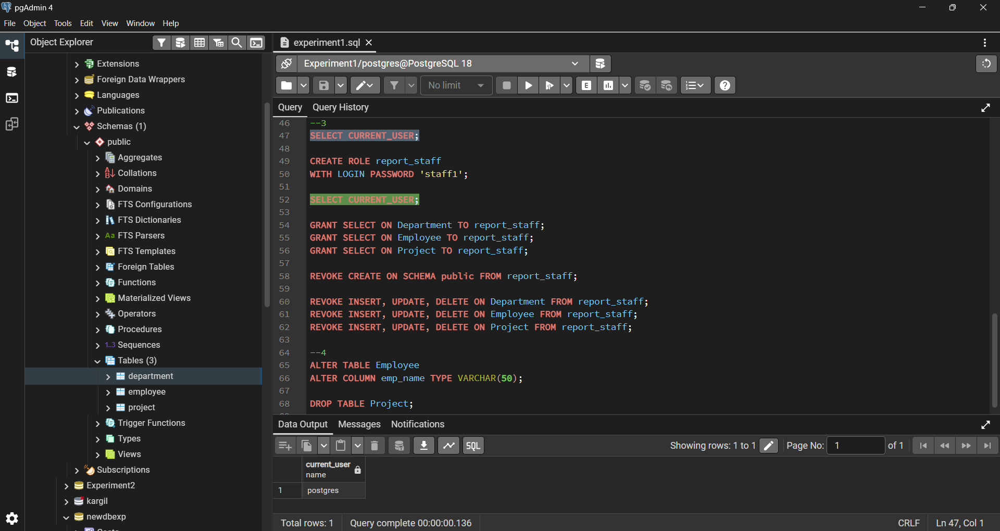
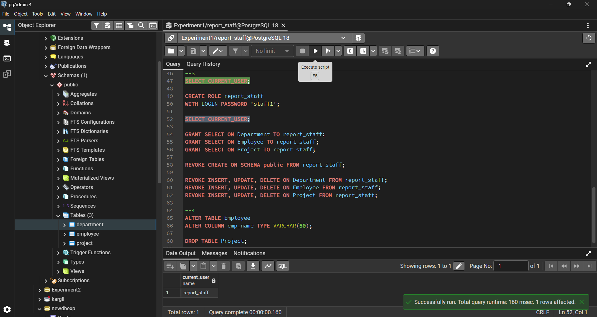
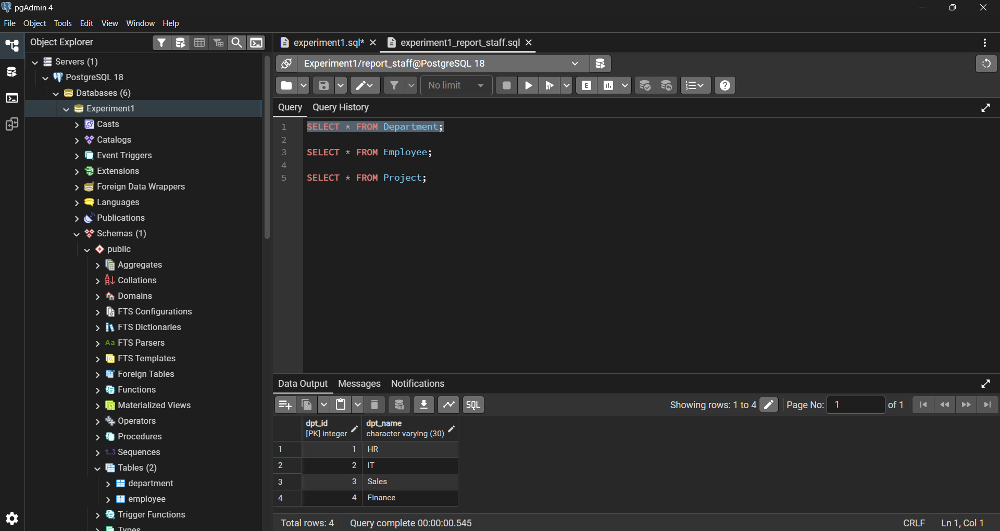
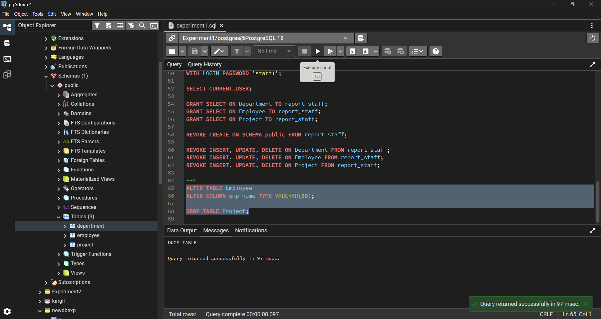

# Experiment No. 1

## Student Details

* **Student Name:** Roshan Kumar Singh
* **UID:** 25MCA20067
* **Branch:** MCA (GEN)
* **Section/Group:** 25MCA-1_A
* **Semester:** 2nd
* **Date of Performance:** 06/01/26
* **Subject Name:** Technical Training–1
* **Subject Code:** 25CAP-652

---

## Aim

To design and implement a sample database system using **DDL, DML, and DCL commands**, including database creation, data manipulation, schema modification, and role-based access control to ensure data integrity and secure, read-only access for authorized users.

## Objective

To gain practical experience in implementing **Data Definition Language (DDL)**, **Data Manipulation Language (DML)**, and **Data Control Language (DCL)** operations in a real database environment, including role-based privilege management for database security.

An organization wants to design a sample database system to manage **Departments**, **Employees**, and **Projects** with controlled access and proper privilege management.

---

## Requirements

### 1. Database Design

* Create tables: `Department`, `Employee`, and `Project`
* Define **PRIMARY KEY** and **FOREIGN KEY** constraints
* Enforce **NOT NULL**, **UNIQUE**, and **CHECK** constraints

### 2. Data Manipulation

* Insert sample records into all tables
* Perform `UPDATE` operations
* Perform `DELETE` operations while maintaining referential integrity

### 3. Access Control & Security

* Create a role/user for reporting staff
* Grant **ONLY SELECT** privilege on required tables
* Explicitly revoke **CREATE** privilege
* Ensure read-only database access

### 4. Schema Modification

* Modify table structure using `ALTER TABLE`
* Drop unnecessary tables using `DROP TABLE`

---

## Software Requirements

* **PostgreSQL with pgAdmin**

---

## Procedure

1. **Start PostgreSQL Environment**

   * Open pgAdmin and connect to PostgreSQL using administrator credentials.

2. **Create Tables Using DDL Commands**

   * Create `Department`, `Employee`, and `Project` tables.
   * Apply primary key, foreign key, and other constraints.

3. **Insert Sample Records**

   * Populate all tables using `INSERT` statements.

4. **Perform Data Manipulation Operations**

   * Modify records using `UPDATE`.
   * Remove records using `DELETE` while maintaining integrity.

5. **Check Current User**

   * Use `SELECT CURRENT_USER;`.

6. **Create Role for Reporting Staff**

   * Create a role with login privileges.

7. **Grant Read-Only Access**

   * Grant `SELECT` privilege on all required tables.

8. **Restrict Unauthorized Operations**

   * Revoke `INSERT`, `UPDATE`, `DELETE`, and `CREATE` privileges.

9. **Modify Database Schema**

   * Use `ALTER TABLE` to change column definitions.

10. **Drop Unnecessary Table**

    * Remove the `Project` table using `DROP TABLE`.

11. **Verify Permissions and Output**

    * Log in using reporting staff role and verify read-only access.

---

## SQL Code

### 1. Table Creation

```sql
CREATE TABLE Department (
    dpt_id INT PRIMARY KEY,
    dpt_name VARCHAR(30) UNIQUE NOT NULL
);

CREATE TABLE Employee (
    emp_id INT PRIMARY KEY,
    emp_name VARCHAR(30) NOT NULL,
    salary INT CHECK (salary > 0),
    dpt_id INT,
    CONSTRAINT fk_dpt FOREIGN KEY (dpt_id) REFERENCES Department(dpt_id)
);

CREATE TABLE Project (
    project_id INT PRIMARY KEY,
    project_name VARCHAR(30) NOT NULL,
    dpt_id INT,
    CONSTRAINT fk_project_dpt FOREIGN KEY (dpt_id) REFERENCES Department(dpt_id)
);
```

### 2. Insert, Update & Delete Operations

```sql
INSERT INTO Department VALUES
(1, 'HR'),
(2, 'IT'),
(3, 'Sales'),
(4, 'Finance');

INSERT INTO Employee VALUES
(101, 'Roshan', 50000, 2),
(102, 'Sanchit', 45000, 1),
(103, 'Riya', 55000, 3),
(104, 'Swayam', 60000, 4);

INSERT INTO Project VALUES
(201, 'Payroll System', 2),
(202, 'Web Application', 2);

UPDATE Employee SET salary = 55000 WHERE emp_id = 101;

DELETE FROM Project WHERE project_id = 202;
```

### 3. User & Role Management

```sql
SELECT CURRENT_USER;

CREATE ROLE report_staff WITH LOGIN PASSWORD 'staff1';

GRANT SELECT ON Department TO report_staff;
GRANT SELECT ON Employee TO report_staff;
GRANT SELECT ON Project TO report_staff;

REVOKE CREATE ON SCHEMA public FROM report_staff;

REVOKE INSERT, UPDATE, DELETE ON Department FROM report_staff;
REVOKE INSERT, UPDATE, DELETE ON Employee FROM report_staff;
REVOKE INSERT, UPDATE, DELETE ON Project FROM report_staff;
```

### 4. Schema Modification

```sql
ALTER TABLE Employee
ALTER COLUMN emp_name TYPE VARCHAR(50);

DROP TABLE Project;
```

---

## Output

* Tables Created

* Data inserted and Updated successfully

* Grant and Revoke for new user

* Current user display

* New user login as current user

* Only SELECT permission granted

* Alter and Droped Succesfully


---

## Learning Outcomes

* Learned to create tables using DDL commands with constraints
* Learned to insert, update, and delete records using DML commands
* Learned to modify database schema using `ALTER TABLE`
* Learned to implement role-based access control using DCL commands
* Learned to grant restricted privileges and enforce secure, read-only database access
