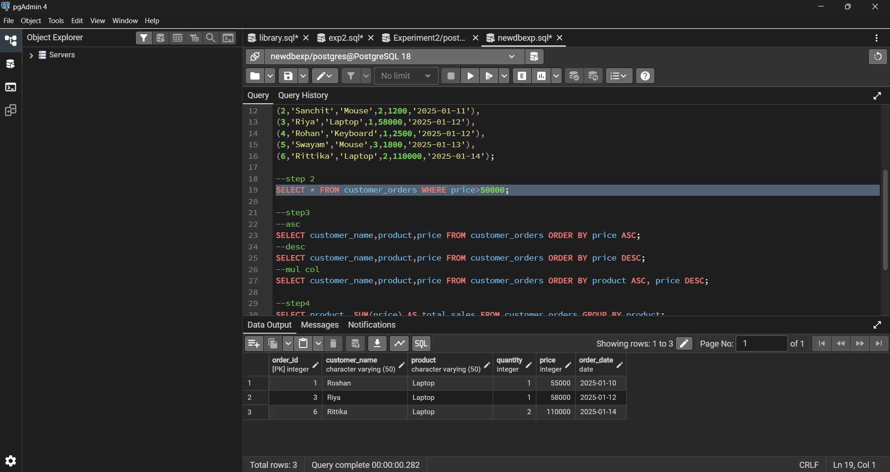
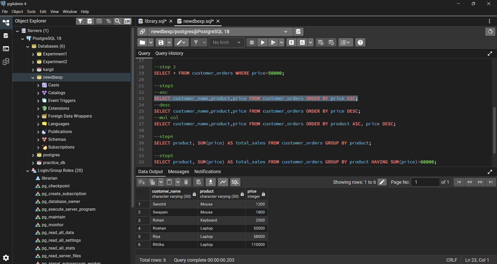
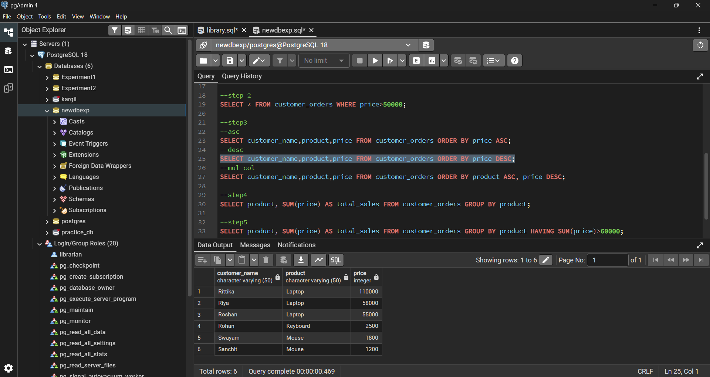
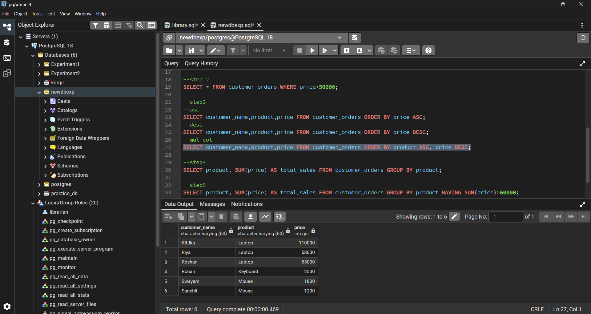
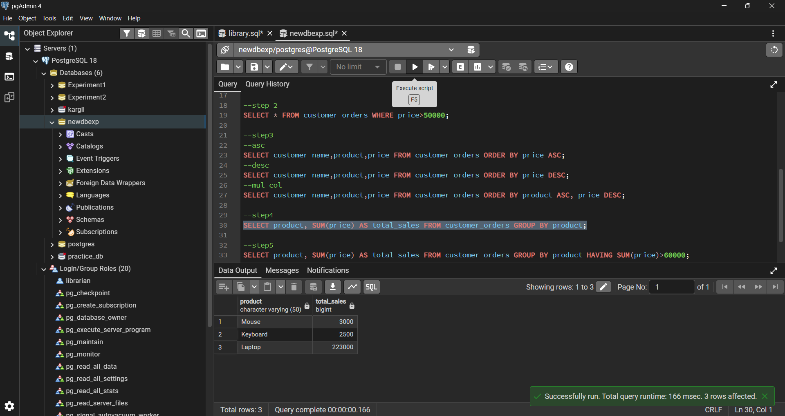
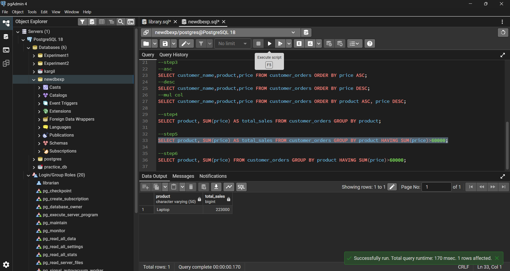
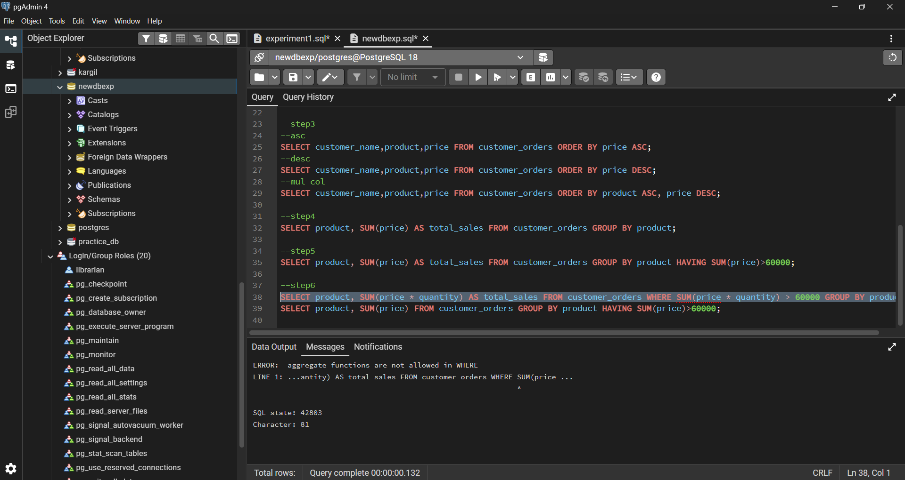
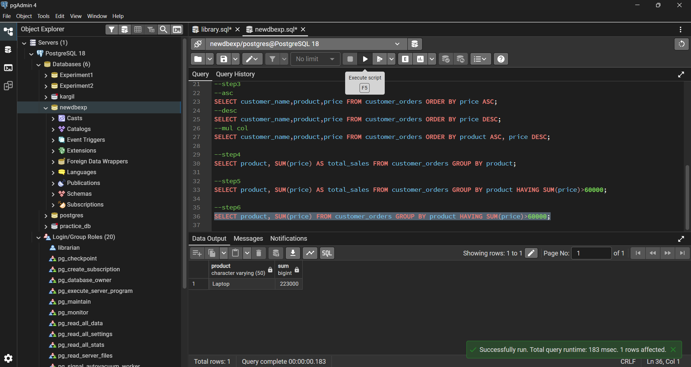

# Experiment No. 2

## Student Details

* **Student Name:** Roshan Kumar Singh
* **UID:** 25MCA20067
* **Branch:** MCA (GEN)
* **Section/Group:** 25MCA-1_A
* **Semester:** 2nd
* **Date of Performance:** 13/01/26
* **Subject Name:** Technical Training–1
* **Subject Code:** 25CAP-652

---

## Aim

To implement and analyze SQL **SELECT queries** using filtering, sorting, grouping, and aggregation concepts in PostgreSQL for efficient data retrieval and analytical reporting.

## Objective

* To retrieve specific data using filtering conditions
* To sort query results using single and multiple attributes
* To perform aggregation using grouping techniques
* To apply conditions on aggregated data
* To understand real-world analytical queries commonly asked in placement interviews

---

## Software Requirement

* **PostgreSQL**

---

## Procedure

### Step 1: Database and Table Preparation

* Start the PostgreSQL server.
* Open the PostgreSQL client tool.
* Create a database for the experiment.
* Create a table to store customer order details such as customer name, product, quantity, price, and order date.
* Insert sufficient sample records for analysis.

### Step 2: Filtering Data Using Conditions

* Retrieve records that satisfy specific conditions such as high-priced orders.
* Observe how filtering limits the number of rows returned.

### Step 3: Sorting Query Results

* Retrieve selected columns and arrange results based on numerical values.
* Perform sorting in ascending and descending order.
* Apply sorting on multiple columns for priority-based ordering.

### Step 4: Grouping Data for Aggregation

* Group records using a common attribute such as product.
* Calculate aggregate values like total sales.
* Observe how multiple rows are summarized.

### Step 5: Applying Conditions on Aggregated Data

* Apply conditions on grouped results using aggregate functions.
* Understand the difference between row-level and group-level filtering.

### Step 6: Filtering vs Aggregation Conditions

* Analyze errors caused by applying conditions before grouping.
* Correctly apply conditions after grouping using `HAVING`.

---

## SQL Code

### Table Creation

```sql
CREATE TABLE customer_orders(
    order_id INT PRIMARY KEY,
    customer_name VARCHAR(50),
    product VARCHAR(50),
    quantity INT,
    price INT,
    order_date DATE
);
```

### Insert Sample Records

```sql
INSERT INTO customer_orders
(order_id, customer_name, product, quantity, price, order_date) VALUES
(1,'Roshan','Laptop',1,55000,'2025-01-10'),
(2,'Sanchit','Mouse',2,1200,'2025-01-11'),
(3,'Riya','Laptop',1,58000,'2025-01-12'),
(4,'Rohan','Keyboard',1,2500,'2025-01-12'),
(5,'Swayam','Mouse',3,1800,'2025-01-13'),
(6,'Rittika','Laptop',2,110000,'2025-01-14');
```

### Step 2: Filtering Records

```sql
SELECT * FROM customer_orders WHERE price > 50000;
```

### Step 3: Sorting Results

```sql
-- Ascending Order
SELECT customer_name, product, price
FROM customer_orders
ORDER BY price ASC;

-- Descending Order
SELECT customer_name, product, price
FROM customer_orders
ORDER BY price DESC;

-- Multiple Column Sorting
SELECT customer_name, product, price
FROM customer_orders
ORDER BY product ASC, price DESC;
```

### Step 4: Grouping and Aggregation

```sql
SELECT product, SUM(price) AS total_sales
FROM customer_orders
GROUP BY product;
```

### Step 5: Conditions on Aggregated Data

```sql
SELECT product, SUM(price) AS total_sales
FROM customer_orders
GROUP BY product
HAVING SUM(price) > 60000;
```

### Step 6: Incorrect vs Correct Query

```sql
-- Incorrect: WHERE cannot be used with aggregate functions
SELECT product, SUM(price * quantity) AS total_sales
FROM customer_orders
WHERE SUM(price * quantity) > 60000
GROUP BY product;
```

```sql
-- Correct: Use HAVING with aggregate functions
SELECT product, SUM(price * quantity) AS total_sales
FROM customer_orders
GROUP BY product
HAVING SUM(price * quantity) > 60000;
```

---

## Output

### Step 2 Output: Filtered Records



### Step 3 Outputs: Sorting

**Ascending Order**


**Descending Order**


**Multiple Column Sorting**


### Step 4 Output: Grouping and Aggregation



### Step 5 Output: HAVING Clause Result



### Step 6 Output

**Incorrect Query Error (WHERE with Aggregate)**


**Correct Output Using HAVING Clause**


---

## Learning Outcomes

* Understood how filtering retrieves only relevant records
* Learned how sorting improves readability of query results
* Gained ability to group data for analytical purposes
* Clearly differentiated between row-level and group-level conditions
* Developed confidence in writing analytical SQL queries used in real-world scenarios
