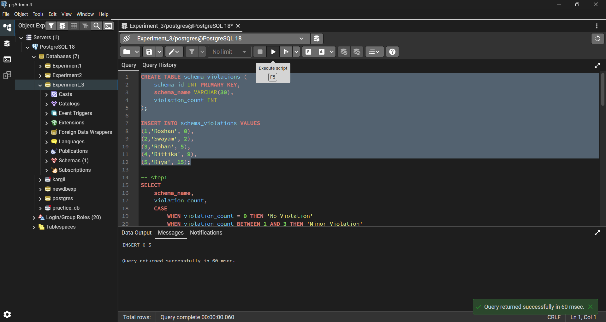
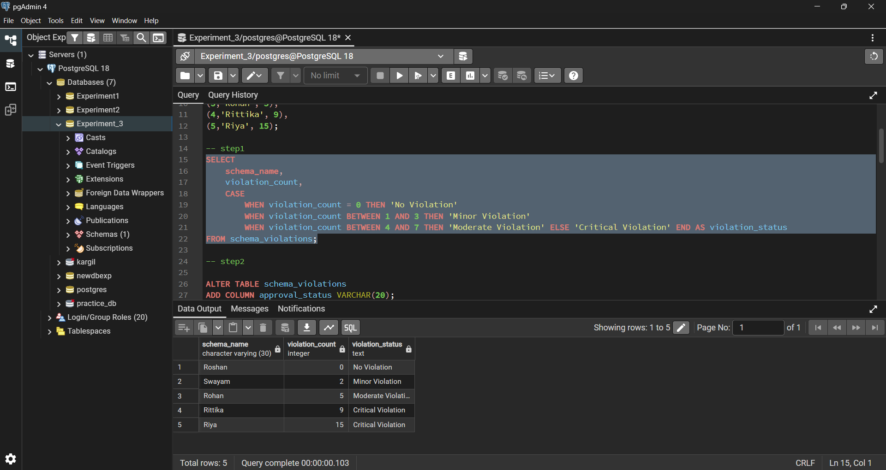
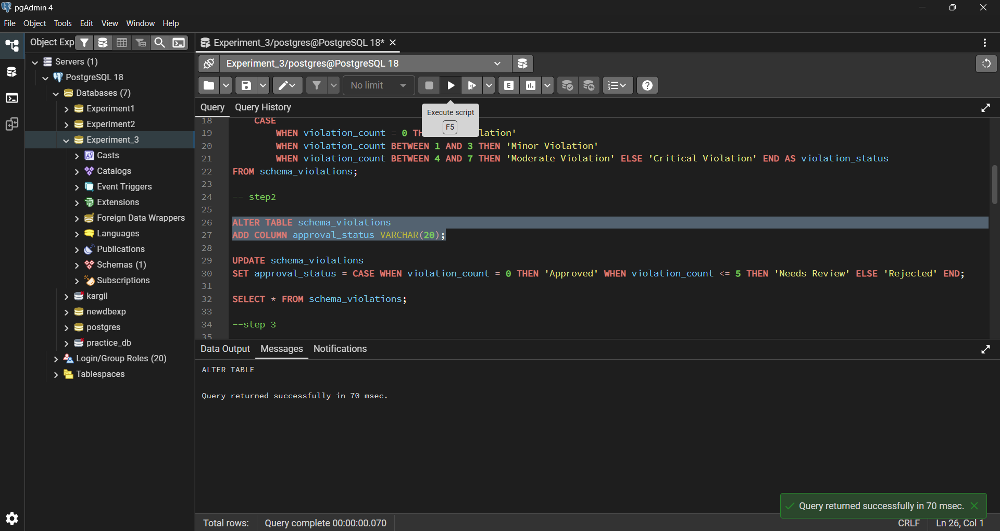
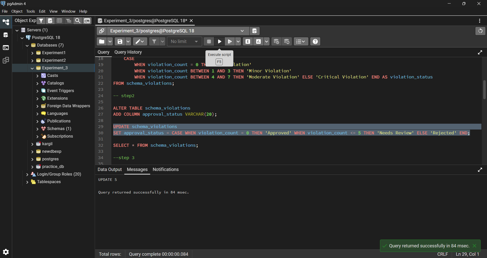
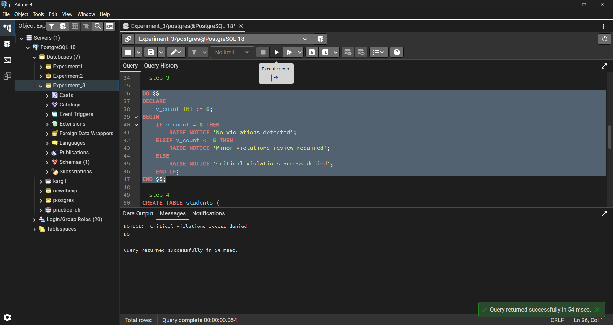
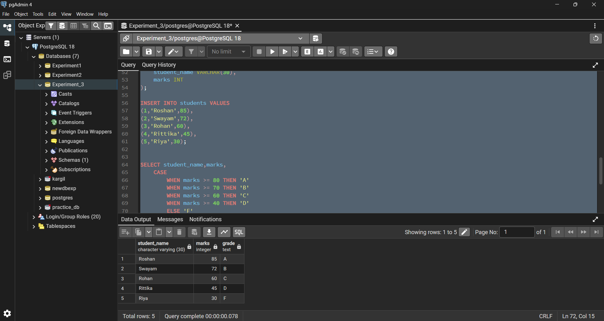
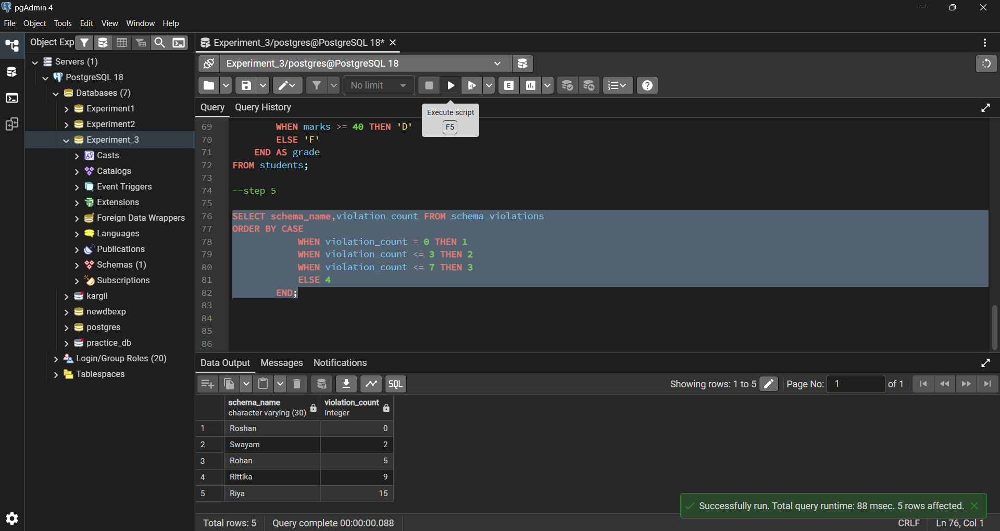

# Experiment No. 3  

### Student Details

- **Student Name:** Roshan Kumar Singh  
- **UID:** 25MCA20067  
- **Branch:** MCA (GEN)  
- **Section/Group:** 25MCA-1_A  
- **Semester:** 2nd  
- **Date of Performance:** 27/01/26  
- **Subject Name:** Technical Training-1  
- **Subject Code:** 25CAP-652  

---

## Aim
To implement conditional decision-making logic in PostgreSQL using IF–ELSE constructs and CASE expressions for classification, validation, and rule-based data processing.

---

## Objectives
- To understand conditional execution in SQL  
- To implement decision-making logic using CASE expressions  
- To simulate real-world rule validation scenarios  
- To classify data based on multiple conditions  
- To strengthen SQL logic skills required in interviews and backend systems  

---

## Software Requirement
- PostgreSQL

---

## Procedure

### Prerequisite Understanding
First create a table that stores:
- A unique identifier  
- A schema or entity name  
- A numeric count representing violations or issues  

Populate the table with multiple records having different violation counts.

---

## Step 1: Classifying Data Using CASE Expression
- Retrieve schema names and their violation counts  
- Use conditional logic to classify each schema into:
  - No Violation  
  - Minor Violation  
  - Moderate Violation  
  - Critical Violation  

---

## Step 2: Applying CASE Logic in Data Updates
- Add a new column to store approval status  
- Update this column based on violation count using:
  - Approved  
  - Needs Review  
  - Rejected  

---

## Step 3: Implementing IF–ELSE Logic Using PL/pgSQL
- Use a procedural block instead of a SELECT statement  
- Declare a variable representing violation count  
- Display messages using IF–ELSE logic  

---

## Step 4: Real-World Classification Scenario (Grading System)
- Create a table to store student names and marks  
- Classify students into grades using conditional logic  

---

## Step 5: Using CASE for Custom Sorting
- Retrieve schema details  
- Apply conditional priority while sorting records based on violation severity  

---

## Code

### Table Creation
```sql
CREATE TABLE schema_violations (
    schema_id INT PRIMARY KEY,
    schema_name VARCHAR(30),
    violation_count INT
);
```
## Insert Records
```sql
INSERT INTO schema_violations VALUES
(1,'Roshan', 0),
(2,'Swayam', 2),
(3,'Rohan', 5),
(4,'Rittika', 9),
(5,'Riya', 15);
```
## Step 1: Violation Classification Using CASE Expression

```sql
SELECT
    schema_name,
    violation_count,
    CASE
        WHEN violation_count = 0 THEN 'No Violation'
        WHEN violation_count BETWEEN 1 AND 3 THEN 'Minor Violation'
        WHEN violation_count BETWEEN 4 AND 7 THEN 'Moderate Violation'
        ELSE 'Critical Violation'
    END AS violation_status
FROM schema_violations;
```

## Step 2: Adding and Updating Approval Status Using CASE

### Add Approval Status Column
```sql
ALTER TABLE schema_violations
ADD COLUMN approval_status VARCHAR(20);
```

### Update Approval Status Using CASE Expression

```sql
UPDATE schema_violations
SET approval_status = CASE
    WHEN violation_count = 0 THEN 'Approved'
    WHEN violation_count <= 5 THEN 'Needs Review'
    ELSE 'Rejected'
END;
```

## Step 3: IF–ELSE Logic Using PL/pgSQL

```sql
DO $$
DECLARE
    v_count INT := 6;
BEGIN
    IF v_count = 0 THEN
        RAISE NOTICE 'No violations detected';
    ELSIF v_count <= 5 THEN
        RAISE NOTICE 'Minor violations review required';
    ELSE
        RAISE NOTICE 'Critical violations access denied';
    END IF;
END $$;
```

## Step 4: Student Table Creation

```sql
CREATE TABLE students (
    student_id INT PRIMARY KEY,
    student_name VARCHAR(30),
    marks INT
);
```

### Insert Student Records

```sql
INSERT INTO students VALUES
(1,'Roshan',85),
(2,'Swayam',72),
(3,'Rohan',60),
(4,'Rittika',45),
(5,'Riya',30);
```
### Grade Classification Using CASE Expression

```sql
SELECT student_name, marks,
    CASE
        WHEN marks >= 80 THEN 'A'
        WHEN marks >= 70 THEN 'B'
        WHEN marks >= 60 THEN 'C'
        WHEN marks >= 40 THEN 'D'
        ELSE 'F'
    END AS grade
FROM students;
```

## Step 5: Custom Sorting Using CASE Expression

```sql
SELECT schema_name, violation_count
FROM schema_violations
ORDER BY CASE
    WHEN violation_count = 0 THEN 1
    WHEN violation_count <= 3 THEN 2
    WHEN violation_count <= 7 THEN 3
    ELSE 4
END;
```

## Output

### Prerequisite: Schema Violation Table Creation
The schema violation table was successfully created and populated with sample data.



---

### Step 1: Violation Classification Using CASE
Violation categories were generated correctly using the `CASE` expression based on violation count.



---

### Step 2: Conditional Approval Status Update

#### Step 2(a): Adding Approval Status Column
The `approval_status` column was added successfully to the table.



#### Step 2(b): Updating Approval Status
Approval status values were updated conditionally using the `CASE` expression.



---

### Step 3: IF-ELSE Logic Using PL/pgSQL
Conditional messages were displayed correctly using IF–ELSE logic in a PL/pgSQL block.



---

### Step 4: Student Grading System
Students were classified into grades correctly based on their marks.



---

### Step 5: Priority-Based Sorting Using CASE
Schema records were sorted according to violation severity using custom CASE-based ordering.



---

## Learning Outcomes

- Understood conditional logic using `CASE` expressions in PostgreSQL  
- Implemented `IF–ELSE` decision-making using PL/pgSQL  
- Applied rule-based validation directly at the database level  
- Used `CASE` logic for data classification, analytics, and custom sorting  
- Improved confidence in writing interview-oriented SQL queries involving conditional logic  

