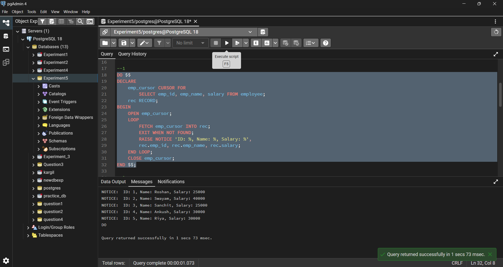
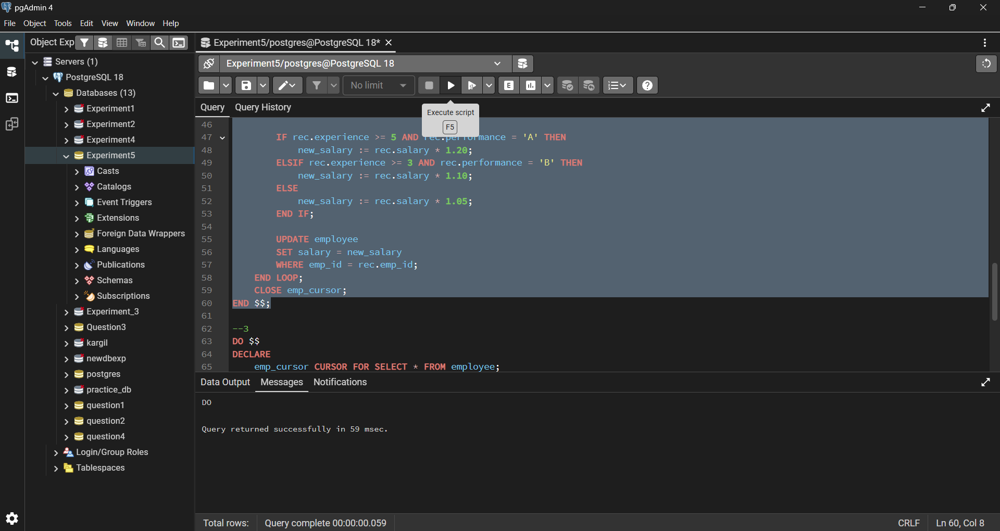
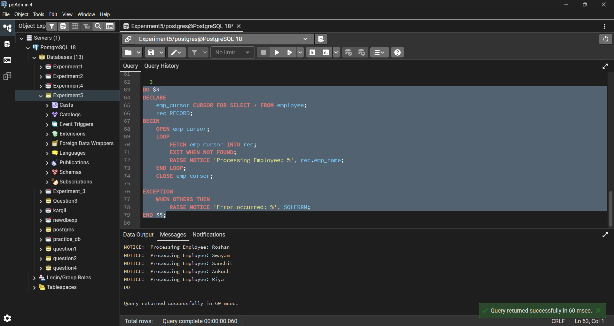

# Experiment 5 – Cursor Implementation in PostgreSQL

## Student Details

- **Student Name:** Roshan Kumar Singh  
- **UID:** 25MCA20067  
- **Branch:** MCA (GEN)  
- **Section/Group:** 25MCA-1_A  
- **Semester:** 2nd  
- **Date of Performance:** 24/02/26  
- **Subject Name:** Technical Training–1  
- **Subject Code:** 25CAP-652  

---

## Aim

To gain hands-on experience in creating and using cursors in PostgreSQL for row-by-row data processing, enabling sequential access and manipulation of query results.

---

## Objectives

- To understand the concept and need of cursors in PostgreSQL  
- To learn sequential data access using cursors  
- To perform row-level manipulation using cursor logic  
- To understand cursor lifecycle management  
- To handle cursor termination and exceptions  

---

## Tools Used

- PostgreSQL  

---

## Procedure

### Step 1: Implementing a Simple Forward-Only Cursor
- Creating a cursor to loop through an employee table  
- Printing individual records sequentially  

### Step 2: Complex Row-by-Row Manipulation
- Using a cursor to update salaries  
- Applying experience-to-performance business logic  

### Step 3: Exception and Status Handling
- Handling cursor termination safely  
- Managing runtime exceptions gracefully  

---

## Code

### Table Creation and Data Insertion

```sql
CREATE TABLE employee (
    emp_id INT PRIMARY KEY,
    emp_name VARCHAR(50),
    salary NUMERIC,
    experience INT,
    performance VARCHAR(1)
);

INSERT INTO employee VALUES
(1, 'Roshan', 25000, 5, 'B'),
(2, 'Swayam', 40000, 3, 'A'),
(3, 'Sanchit', 25000, 2, 'C'),
(4, 'Ankush', 30000, 4, 'A'),
(5, 'Riya', 30000, 3, 'B');

```
### Step 1: Implementing a Simple Forward-Only Cursor
```sql
--1
DO $$
DECLARE
    emp_cursor CURSOR FOR
        SELECT emp_id, emp_name, salary FROM employee;
    rec RECORD;
BEGIN
    OPEN emp_cursor;
    LOOP
        FETCH emp_cursor INTO rec;
        EXIT WHEN NOT FOUND;
        RAISE NOTICE 'ID: %, Name: %, Salary: %',
        rec.emp_id, rec.emp_name, rec.salary;
    END LOOP;
    CLOSE emp_cursor;
END $$;
```
### Step 2: Complex Row-by-Row Manipulation
```sql
--2
DO $$
DECLARE
    emp_cursor CURSOR FOR
        SELECT emp_id, salary, experience, performance FROM employee;
    rec RECORD;
    new_salary NUMERIC;
BEGIN
    OPEN emp_cursor;
    LOOP
        FETCH emp_cursor INTO rec;
        EXIT WHEN NOT FOUND;

        IF rec.experience >= 5 AND rec.performance = 'A' THEN
            new_salary := rec.salary * 1.20;
        ELSIF rec.experience >= 3 AND rec.performance = 'B' THEN
            new_salary := rec.salary * 1.10;
        ELSE
            new_salary := rec.salary * 1.05;
        END IF;

        UPDATE employee
        SET salary = new_salary
        WHERE emp_id = rec.emp_id;
    END LOOP;
    CLOSE emp_cursor;
END $$;
```
### Step 3: Exception and Status Handling
```sql
--3
DO $$
DECLARE
    emp_cursor CURSOR FOR SELECT * FROM employee;
    rec RECORD;
BEGIN
    OPEN emp_cursor;
    LOOP
        FETCH emp_cursor INTO rec;
        EXIT WHEN NOT FOUND;
        RAISE NOTICE 'Processing Employee: %', rec.emp_name;
    END LOOP;
    CLOSE emp_cursor;

EXCEPTION
    WHEN OTHERS THEN
        RAISE NOTICE 'Error occurred: %', SQLERRM;
END $$;
```
---
## Output Screenshots

### Table Creation and Data Insertion


### Step 1: Implementing a Simple Forward-Only Cursor


### Step 2: Complex Row-by-Row Manipulation


### Step 3: Exception and Status Handling


---

## Learning Outcomes

- Understood cursor-based row-by-row processing  
- Learnt cursor lifecycle in PostgreSQL  
- Applied complex conditional logic using cursors  
- Handled cursor termination and exceptions  
- Gained confidence in writing procedural SQL programs  
