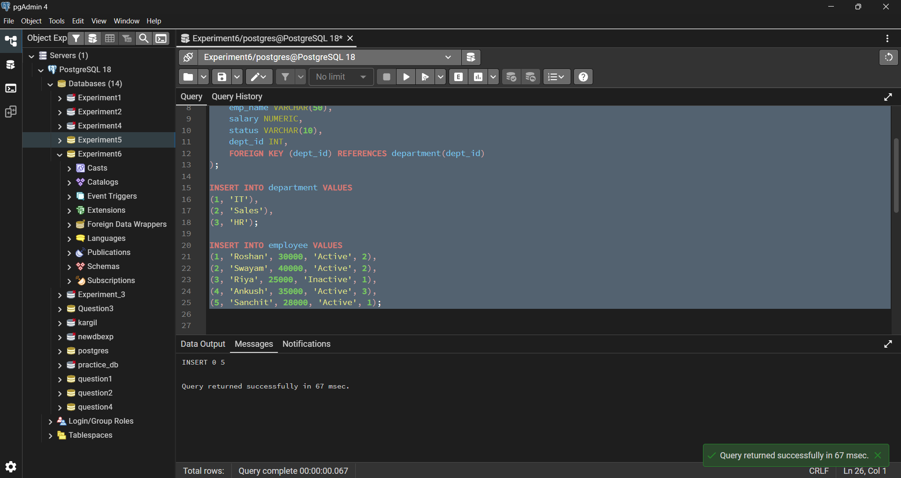
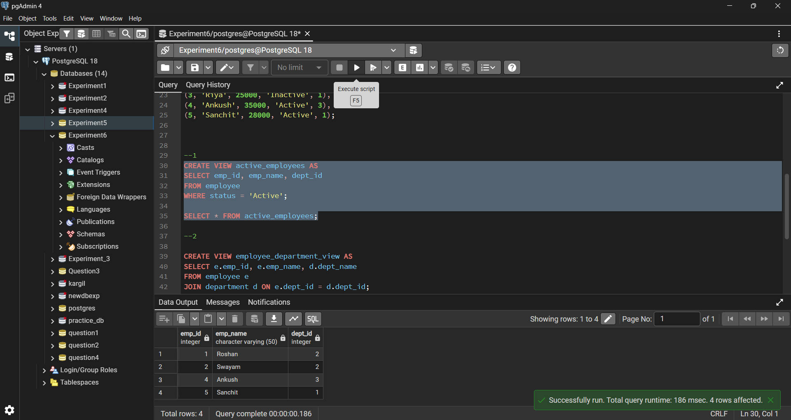
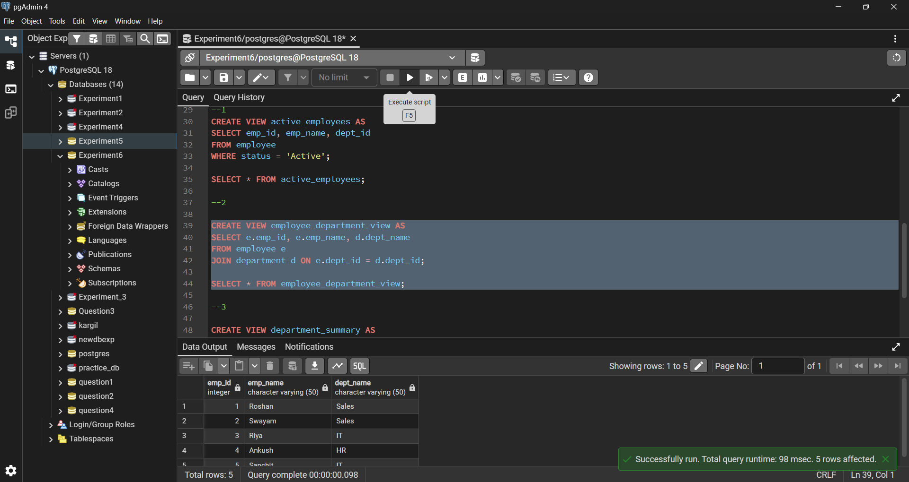

# Experiment 6 

---

## Student Details

- **Student Name:** Roshan Kumar Singh  
- **UID:** 25MCA20067  
- **Branch:** MCA (GEN)  
- **Section/Group:** 25MCA-1_A  
- **Semester:** 2nd  
- **Date of Performance:** 24/02/26  
- **Subject Name:** Technical Training–1  
- **Subject Code:** 25CAP-652  

---

## Aim

To learn how to create, query, and manage views in PostgreSQL in order to simplify database queries and provide a layer of abstraction and security for end-users.

---

## Objectives

- To understand data abstraction using views  
- To learn how views enhance database security  
- To simplify complex queries using views  
- To understand creation, modification, and deletion of views  
- To apply views in real-world scenarios like payroll and reporting  

---

## Tools Used

- PostgreSQL  

---

## Procedure

### Step 1: Creating a Simple View for Data Filtering
- Create a view to show only active employees  
- Hide unnecessary columns  

### Step 2: Creating a View for Joining Multiple Tables
- Combine employee and department data  
- Simplify multi-table queries  

### Step 3: Advanced Summarization View
- Generate department-level statistics automatically  

---

## Code

### Table Creation

```sql
CREATE TABLE department (
    dept_id INT PRIMARY KEY,
    dept_name VARCHAR(50)
);

CREATE TABLE employee (
    emp_id INT PRIMARY KEY,
    emp_name VARCHAR(50),
    salary NUMERIC,
    status VARCHAR(10),
    dept_id INT,
    FOREIGN KEY (dept_id) REFERENCES department(dept_id)
);
```


### Step 1: Creating a Simple View for Data Filtering
	

```sql
CREATE VIEW active_employees AS
SELECT emp_id, emp_name, dept_id
FROM employee
WHERE status = 'Active';

SELECT * FROM active_employees;
```
Step 2: Creating a View for Joining Multiple Tables
```sql

CREATE VIEW employee_department_view AS
SELECT e.emp_id, e.emp_name, d.dept_name
FROM employee e
JOIN department d ON e.dept_id = d.dept_id;

SELECT * FROM employee_department_view;
```
### Step 3: Advanced Summarization View
```sql

CREATE VIEW department_summary AS
SELECT d.dept_name,
       COUNT(e.emp_id) AS total_employees,
       AVG(e.salary) AS average_salary
FROM department d
JOIN employee e ON d.dept_id = e.dept_id
GROUP BY d.dept_name;

SELECT * FROM department_summary;

DROP VIEW department_summary;
```
---
## Output Screenshots

### Table Creation and Data Insertion


### Step 1: Creating a Simple View for Data Filtering


### Step 2: Creating a View for Joining Multiple Tables


### Step 3: Advanced Summarization View


---

## Learning Outcomes

- Understood the concept of views in PostgreSQL  
- Learnt how views provide data abstraction and security  
- Created simple and complex views  
- Used views for reporting and summarization  
- Gained practical knowledge of real-world database design  

---


